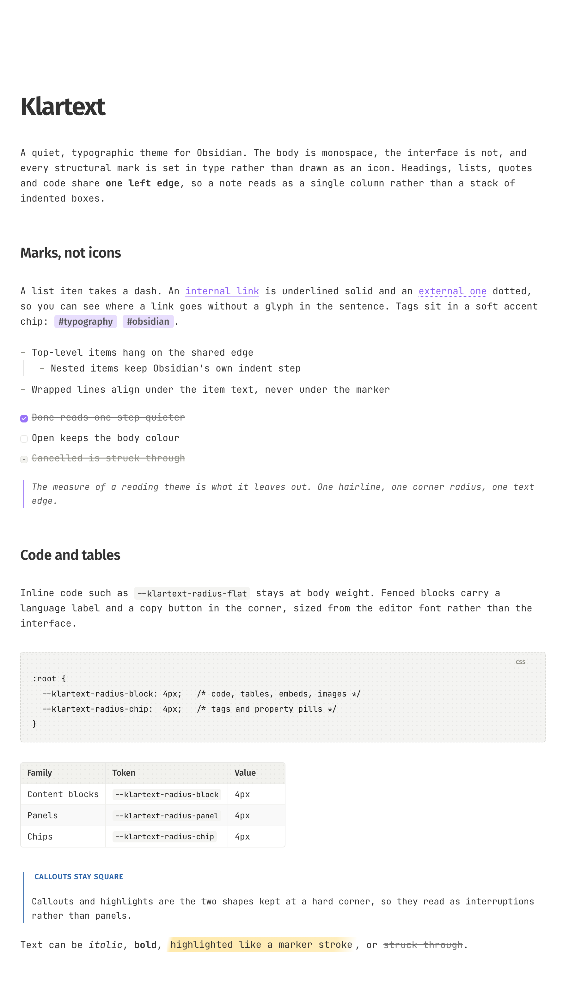
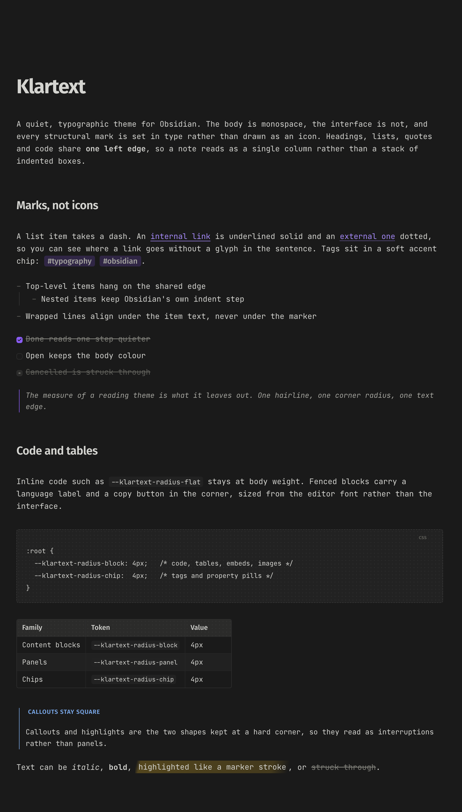

# Klartext

A quiet, typographic theme for Obsidian. The body is monospace, the interface is not,
and every structural mark is set in type rather than drawn as an icon.

Headings, lists, quotes, tables and code share **one left edge**, so a note reads as a
single column rather than a stack of indented boxes. Both colour schemes ship in the
one file and follow Obsidian's own light/dark setting.

## Screenshots

**Light**



**Dark**



## What it does differently

- **Marks instead of icons.** A heading carries its level as a small `#₁`…`#₆` badge
  hung in the margin. A list item takes a dash, whichever of `-`, `*` or `+` was
  typed; an ordered item takes its number alone, without the dot. A task takes its
  box, a quote its bar. A collapsible section opens with `+` and closes with `−`. A
  code block's language is a lowercase word. None of these are images, so they scale
  with your text size and match the body face.
- **One left edge.** Headings and prose start on the paragraph edge, and every mark
  sits right there, in the text flow: the dash, the number, the checkbox, the quote
  bar. Their text starts one marker column further in — the same edge for lists,
  tasks, quotes and callouts — and keeps it whether you are reading the note,
  editing another line, or editing that very line. Wrapped lines return to that
  edge. Nested items step in by exactly one column, so a nested mark starts where
  its parent's text starts. Only the heading badge hangs outside the text.
- **Link destination in the underline.** Internal links are underlined solid,
  external links dotted. No arrow glyph interrupts the sentence.
- **A highlight is a marker stroke.** Each line lands and lifts like a pen on paper,
  and the stroke runs unbroken through any code, bold or link inside it.
- **One corner radius.** Content blocks, panels, chips and the flat interface all sit
  at 4px, each from its own named token so any family can be retuned alone. Callouts
  and highlights are deliberately square.
- **One text size per device, the interface derived.** Obsidian's font-size slider
  lives in the vault and therefore syncs to every device, which makes one value
  serve a desktop display and a phone. Klartext takes the phone off that slider, so
  the two can be set independently. Sidebars, panels and plugin text are not a
  third control: on the desktop they follow Appearance → Font size at thirteen
  sixteenths, on the phone they follow Mobile Body Text Size one to one. Enlarge
  the prose for a high-resolution display and the interface comes with it.
- **Vertical rhythm on purpose.** Paragraph gaps, heading margins and blank lines are
  derived from the body line height rather than left to defaults, and Reading view is
  matched to Live Preview so switching modes does not shift the text.

## Requirements

- **Obsidian 1.4 or newer**, which is what `minAppVersion` declares. That floor is
  set by Properties, introduced in 1.4 and styled by this theme. Everything else the
  theme touches predates it.
- A reasonably current **installer**. Two CSS features the layout depends on, `:has()`
  and `round()`, come from the Chromium inside Obsidian's installer rather than from
  the app version, so `minAppVersion` cannot express them. Obsidian updates the app
  and the installer separately; if the marker column or the quote bar sits wrong on a
  very old installation, reinstall from the download page. Developed and measured
  against Obsidian 1.13.7.
- [Style Settings](https://github.com/mgmeyers/obsidian-style-settings) for the
  options below. The theme works without it, at the defaults.
- No font installation. JetBrains Mono ships inside the stylesheet as a 400–700
  variable face, upright and italic, so bold and bold-italic are real faces rather
  than synthesized.

## Installation

**From Obsidian**  Settings → Appearance → Themes → Manage, then search for Klartext
and click Use.

**Manually**  Copy this folder to `<vault>/.obsidian/themes/Klartext`, so that
`theme.css` and `manifest.json` sit directly inside it. Then pick Klartext in
Settings → Appearance.

## Options

All of these live in Settings → Style Settings → Klartext. They are about how
Klartext looks.

What is on screen is a separate question, and the
[Klartext plugin](https://github.com/smsag/klartext-plugin) answers it: the top
row shown only while the pointer is at the top of the window, the macOS window
buttons with it, and switches for the tab bar, status bar, vault profile, scroll
bars, sidebar buttons, tooltips, the file explorer's buttons, Reading-view
properties, search suggestions and counts, and prompt hints. They lived in this
theme until 2.0.0 and moved because several needed code a theme cannot run, and
because a switch that hides furniture should survive a change of theme. No
setting lives in both.

| Option | Default | What it does |
|---|---|---|
| Dotted Code & Header Fill | on | A faint dot-grid texture on code blocks and table headers |
| Center Mermaid Diagrams | on | Centres rendered diagrams in the text column |
| Greyscale Mermaid Diagrams | on | Renders diagrams in the theme's greys instead of Mermaid's colours |
| Mobile Body Text Size | 14px | Body text on phone and tablet, independent of Appearance → Font size. The phone's interface text follows it one to one |
| Readable Line Width | 680px | Width of the text column. Read only while Settings → Editor → "Readable line length" is on; with it off the column spans the pane |
| Line Height | 1.6 | Body leading |
| Marker Column | Two characters | Width of the column that holds the marks. Two: a dash or a single digit is flush with the text edge, numbers from 10 hang into the margin. Four: three digits fit inside, right-aligned |
| Note Title Font | Body monospace | The note's own title, which carries the h1 size and weight: the body face, or the heading face (Fira Sans) to match the headings below it |
| Lists Indented With Spaces | off | Turn on if Editor → "Indent using tabs" is off. Only the list tree line needs to know, and CSS cannot see it. Assumes four spaces per level |

### Obsidian's own settings

Most of Obsidian's appearance settings work as usual under Klartext: the accent
colour, Appearance → Font size on the desktop, and Editor → "Readable line
length". The rule for the fonts: **the interface and code are yours, the note's
own type is the theme's.** The body, its marks and the headings are one
designed pairing, JetBrains Mono with Fira Sans, and a font picked for the
sidebars does not reach into the note. In detail:

| Obsidian setting | Under Klartext |
|---|---|
| Appearance → Interface font | Followed by the interface: sidebars, tabs, menus, dialogs, the status bar. Fira Sans when it is empty. **Not by the note's headings**, callout titles, embed titles, or a note title set to the heading face: those are the note's type, paired with the body, and stay Fira Sans |
| Appearance → Monospace font | Followed: inline code, code blocks and math source. JetBrains Mono when it is empty |
| Appearance → Text font | **Ignored.** The body stays JetBrains Mono, because every mark (the dash, the number, the checkbox, the heading badge) is placed on one character cell of the body face; a proportional face would pull them off the text edge |
| Appearance → Font size | Followed on the desktop. **On a phone or tablet Mobile Body Text Size replaces it**, because the slider syncs with the vault and one value cannot serve both screens |
| Editor → Tab indent size | Applies to code and plain indented lines, **not to list levels**: a nested item steps in by one marker column whatever the tab size (`--list-indent` changes that step) |

After editing `theme.css` by hand, Style Settings keeps its cached parse until it
re-reads the file. Switching theme away and back, or restarting Obsidian, refreshes it.

A few things are deliberately not settings. The page is white. Nested lists step in by exactly one
marker column, so nested marks land on the parent's text edge; the interface
size follows the body size (a snippet can set `--klartext-ui-font-size` outright); the paragraph gap
is what keeps Live Preview and Reading view in step; Mermaid labels sit at 0.9 of
the body size; diagrams are centred; the scroll edge under the header is soft.
Each still has a token, so a CSS snippet can change it:

```css
body {
  --list-indent: 2em;            /* nesting step */
  --klartext-p-gap: 1.2;         /* paragraph gap, × line height */
  --klartext-diagram-font-scale: 1;
  --klartext-tab-size: 2;        /* spaces per level, with Lists Indented With Spaces on */
}
```

## Mobile

Phone and tablet are treated as their own targets rather than a narrower desktop. The
marker column is symmetric so the text block stays centred, Reading view and Live
Preview get the same side padding so switching modes does not shift the text, and the
body size is its own setting. Several places where Obsidian restates a token under a
higher-specificity mobile selector are answered explicitly, so the theme's value wins
rather than Obsidian's.

## Notes for anyone editing it

The stylesheet is `src/theme.css`, one file sectioned by element with a comment block
above each rule that explains why the value is what it is. The `theme.css` at the
repository root is built from it by `python3 fonts/embed.py`, which appends the
embedded fonts; it is the file Obsidian installs and must stay committed, but it is
not the file to edit. Where a number was measured rather than chosen,
the comment says what it was measured against. The `@settings` block at the top of the
file is the Style Settings schema; the four `--klartext-radius-*` tokens are the corner
system; `--klartext-font-size` is the body size every derived length chains from;
`--klartext-col` is the marker column that holds every mark, on the text edge.

Live Preview keeps a block's source marker in the editor as real text, and the theme
relies on that: Obsidian measures each line's hanging indent from the caret position at
the end of the marker, so the theme makes every marker token exactly one column wide
and lets the indent follow. The characters that must not show — the space, `-`, `*`,
`+`, `>`, and the dot after a number — are hidden by a font rather than by CSS:
`Klartext Marks` and its `Quote` variant, two 400-byte faces of empty glyphs built by
`fonts/make-marks.py` and embedded like the others. Nothing is clipped, boxed in flex or painted over, which is
what keeps the caret visible and the layout the same in every state.

Measured values were taken in the running Obsidian over Chromium's debugging port
(`open -a Obsidian --args --remote-debugging-port=9222`), where the caret position,
the inline hanging indent and screenshots of the real editor can be read directly.
`tools/verify.mjs` uses the same port to check that a change alters nothing it
should not: it opens `tools/check-note.md`, records the computed style of every
element in Live Preview and Reading view, light and dark, with and without the
mobile body classes, and diffs two such snapshots. The header of the script shows
the sequence; a refactor is done when the diff is empty.

`.stylelintrc.json` catches duplicate selectors, duplicate or shorthand-overridden
declarations and empty blocks (`npx stylelint src/theme.css`). Its
descending-specificity rule is off on purpose: restating a selector at Obsidian's
own specificity, later in the cascade, is how this theme wins ties.
`git config core.hooksPath .githooks` runs the check before any commit that
touches the stylesheet.

`CHANGELOG.md` follows [Keep a Changelog](https://keepachangelog.com/en/1.1.0/) and
records the mechanism behind each change, not just the outcome.

What the repository holds, and why: `theme.css` and `manifest.json` are what
Obsidian installs; the theme store also reads this README and the screenshots.
`src/theme.css` is the stylesheet as written, without the fonts. `fonts/` is
source, not shipped: the subsetted `.woff2` files that `fonts/embed.py` appends
to `src/theme.css` as base64 to produce `theme.css`, the two licence texts, and
`fonts/make-marks.py`, which builds the Klartext Marks faces. They stay in the
repository so the embedded fonts can be rebuilt or re-subsetted without hunting
for the originals. Nothing else belongs here; backups of earlier versions are
git history, not files.

## Credits

By [Steffen Seitz](https://smsag.de), under the [MIT License](LICENSE).

Typefaces: [JetBrains Mono](https://www.jetbrains.com/lp/mono/), copyright 2020
The JetBrains Mono Project Authors, and [Fira Sans](https://github.com/mozilla/Fira),
digitized data copyright 2012–2016 The Mozilla Foundation and Telefonica S.A.
Both are used under the SIL Open Font License 1.1, which permits bundling them
with software as long as the copyright notice and the licence travel with them:
the notices are inside the embedded fonts' own metadata, and the full licence
texts are in [fonts/LICENSE-JetBrainsMono.txt](fonts/LICENSE-JetBrainsMono.txt)
and [fonts/LICENSE-FiraSans.txt](fonts/LICENSE-FiraSans.txt). Neither face
declares a Reserved Font Name, so the subsetted copies may keep their names.
The Klartext Marks faces are part of the theme and under its MIT licence.
