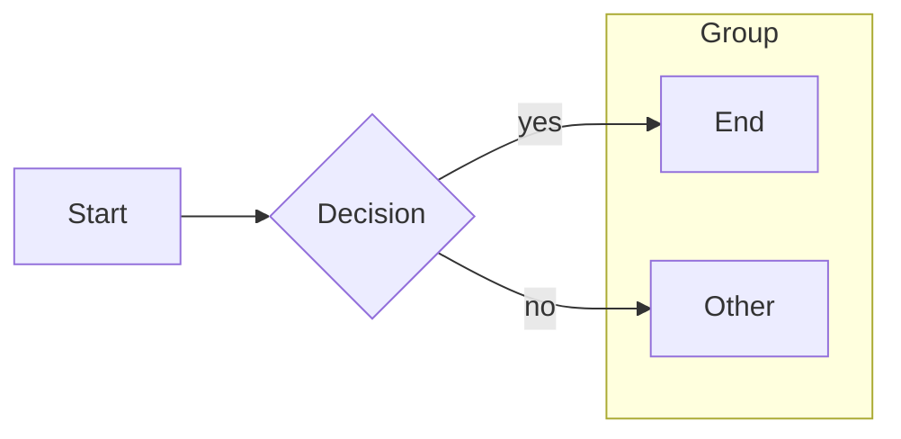

# Heading one

A paragraph with **bold**, *italic*, ~~struck~~, ==a highlight with `code` and **bold** inside it==, `inline code`, an [[Klartext refactor check|internal link]], an [external link](https://example.com), an [[Nonexistent note]], and a #tag. Footnote here.[^1] Block id here. ^blockid

## Heading two

### Heading three

#### Heading four

##### Heading five

###### Heading six

Paragraph before a list:

- first bullet
- second bullet, long enough to wrap across the line in a narrow column, and then some more words to be sure it wraps
	- nested one
		- nested two
			- nested three
* asterisk bullet
+ plus bullet

1. one
2. two
3. three
4. four
5. five
6. six
7. seven
8. eight
9. nine
10. ten
11. eleven
	1. nested ordered
	2. nested ordered two

- [ ] open task
- [x] done task with **bold**
	- [ ] nested open under done
- [-] cancelled task

> A quote, long enough to wrap across the line in a narrow column, and then some more words.
A lazy line: no marker, still part of the quote, and long enough to wrap onto a second line in the column.
> > nested quote
> > > third level

> [!note] Note callout
> Body text with a list:
> - item
> - item

> [!tip] Tip
> Tip body.

> [!warning]- Folded warning
> Hidden body.

> [!custom] Custom type
> Body.

```js
const x = 1; // comment
function f(a) { return "string" + a; }
```

```dataviewjs
dv.list([1,2])
```

```
no language fence
```

```obscurelang
unlisted language
```

| Left | Center | Right | Long |
|:-----|:------:|------:|------|
| a | b | c | a longer prose cell that should wrap at some point because it is long |
| d | e | f | short |
| g | h | i | short |

---

Inline math $E = mc^2$ and block math:

$$
\int_0^1 x^2 \, dx = \frac{1}{3}
$$



![[missing-image.png]]

![[Nonexistent note]]

<kbd>Cmd</kbd>+<kbd>P</kbd>, H<sub>2</sub>O, x<sup>2</sup>.

<details><summary>Details summary</summary>

Hidden details body.

</details>

Last paragraph.

[^1]: The footnote text.
